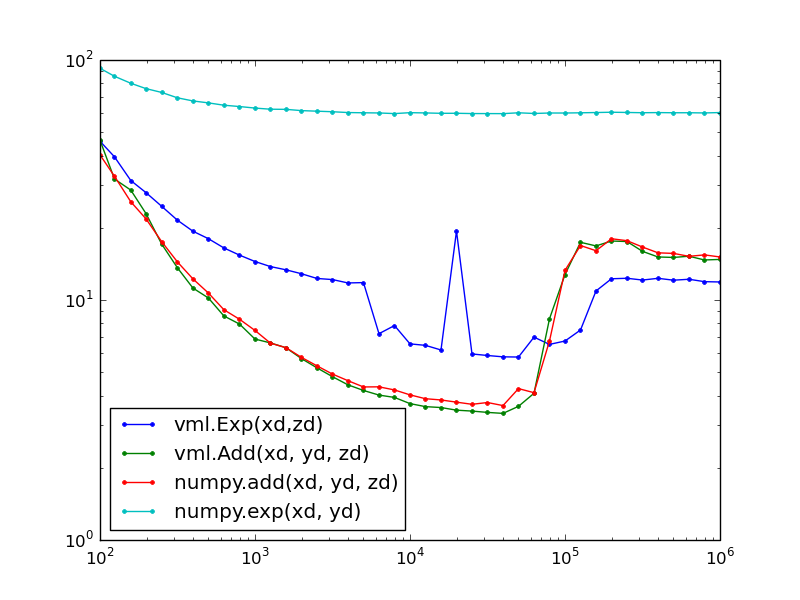

uvml
====

Provide vectorized math function (MKL) for numpy

In numpy some of the 'ufuncs', in particular transcedental math operations such es exp, sin, log, do not use optimized implementations. This package provides ufuncs using fast implementations of the Intel VML library, which is part of Intels Math Kernel Library (MKL). Using `numpy.set_numeric_ops`  you can replace some of the internal numpy ufuncs with optimized ones (a shortcut is provided by `vml.use_vml(True)` ). By this you can gain some speed improvements without changing your code.

However, a much better approach than this package is using numexpr, numba or theano. 

This benchmark (on an ancient Intel Core2Duo CPU) demonstrates the speed gain that can be achieved with this package. Shown is the execution time (in CPU cycles) for various array sizes. For example, for `exp` a speed gain up to 5x - 10x can be achieved. Above array sizes of 10^4 all (two) cores are used, sometimes even leading to an (accidental) slowdown. Above array sizes of 10^5 the data is too large to fit into the cache, performance is limited by the available memory bandwidth and not by the computing power of the CPU. 

For basic operations such as addition or multiplication compilers produce optimized code, so no speed gain using this package. 

For optimum performance keeping the data in cache is crucial, therefor approaches like numexpr, numba or theano will likely perform faster calculations for composite expressions. 

Note
----

This is ancient code from 2009.

License
-------

LGPL

(C) Gregor Thalhammer
